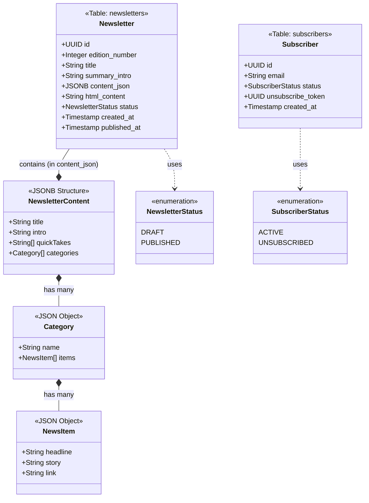

```mermaid
classDiagram
    %% Enums
    class NewsletterStatus {
        <<enumeration>>
        DRAFT
        PUBLISHED
    }

    class SubscriberStatus {
        <<enumeration>>
        ACTIVE
        UNSUBSCRIBED
    }

    %% Database Entities (Supabase)
    class Newsletter {
        <<Table: newsletters>>
        +UUID id
        +Integer edition_number
        +String title
        +String summary_intro
        +JSONB content_json
        +String html_content
        +NewsletterStatus status
        +Timestamp created_at
        +Timestamp published_at
    }

    class Subscriber {
        <<Table: subscribers>>
        +UUID id
        +String email
        +SubscriberStatus status
        +UUID unsubscribe_token
        +Timestamp created_at
    }

    %% Virtual Entities (JSONB Structure)
    class NewsletterContent {
        <<JSONB Structure>>
        +String title
        +String intro
        +String[] quickTakes
        +Category[] categories
    }

    class Category {
        <<JSON Object>>
        +String name
        +NewsItem[] items
    }

    class NewsItem {
        <<JSON Object>>
        +String headline
        +String story
        +String link
    }

    %% Relationships
    Newsletter --* NewsletterContent : contains (in content_json)
    NewsletterContent *-- Category : has many
    Category *-- NewsItem : has many
    Newsletter ..> NewsletterStatus : uses
    Subscriber ..> SubscriberStatus : uses
```
