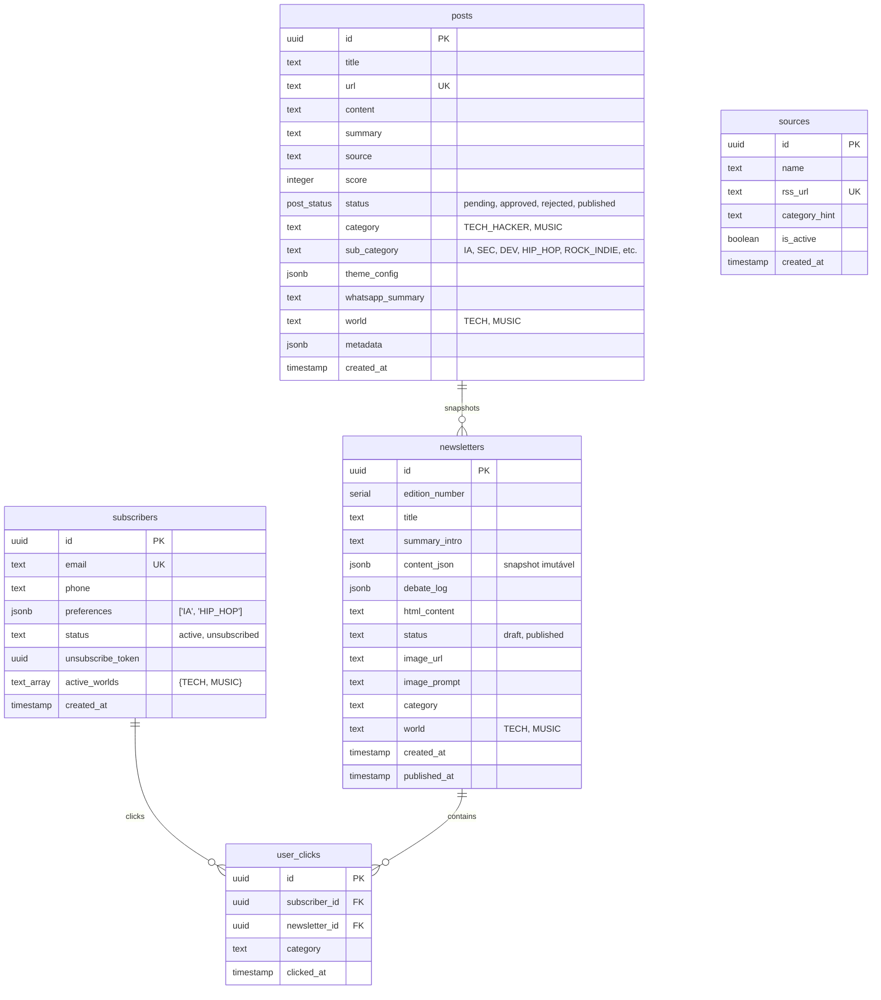

# 📰 PRODUCT REQUIREMENT DOCUMENT (PRD) — FRESH NEWS (v2.0)

## 1. Visão Geral do Produto

A **Fresh News** é uma plataforma editorial premium e automatizada de curadoria de notícias. Idealizada para transformar o caos da sobrecarga de informação diária em uma experiência de leitura limpa, focada e de alta autoridade técnica/cultural, enviada diretamente para a caixa de entrada (E-mail) e dispositivo preferido (WhatsApp) do assinante.

A plataforma adota o conceito de **Digital Brutalism ("The Neo-Broadsheet")**, inspirado na tipografia e diagramação de jornais impressos físicos de alta credibilidade histórica, adaptado para telas digitais modernas com componentes reativos, cores vibrantes por categoria e animações fluidas.

Na versão **v2.0 (Multiverso)**, a plataforma expande-se para além do mundo tecnológico original, oferecendo a vertical de **Música** de forma independente, chaveável pelo usuário através de uma interface de multiverso fluida e integrada.

---

## 2. Objetivos Estratégicos & Proposta de Valor

*   **Curadoria Inteligente**: Captura automática via RSS de dezenas de veículos renomados (tech e música), consolidada e ranqueada por Inteligência Artificial (OpenAI GPT-4o/Gemini) com scores de relevância (0-100).
*   **Edição Mestra Única por Mundo**: Cada universo/mundo possui a sua própria Edição Mestra, otimizando o fluxo de leitura de acordo com o contexto (Tech diária/Música semanal).
*   **Personalização Centrada no Assinante**: O motor de distribuição recorta e envia apenas as categorias de interesse que o assinante configurou na sua Central de Preferências dentro de seus mundos ativos.
*   **Design Camaleão Reativo**: Interface que se transforma esteticamente em tempo real (cores e efeitos visuais) para refletir a identidade visual do post ou da categoria selecionada pelo leitor.
*   **Arquitetura Multiverso Desacoplada**: A fundação lógica permite adicionar novos verticais (esportes, finanças, etc.) no futuro com impacto zero nos módulos existentes.

---

## 3. Requisitos Funcionais

### RF-01: Ingestão de Conteúdo e Inteligência Artificial (Pipeline RSS)
*   **Captura Autônoma**: O sistema monitora feeds RSS configurados na tabela `sources` e extrai o conteúdo bruto e metadados das notícias.
*   **Enriquecimento & Map-Reduce**: O motor de IA agrupa notícias similares, descarta duplicadas, redige resumos técnicos e culturais focados, categoriza os posts e atribui notas de relevância (score).

### RF-02: Painel Administrativo de Moderação
*   **Acesso Seguro**: Rota `/admin` protegida por autenticação cookie-based com segurança de sessão `HTTP-Only`.
*   **Curadoria por Mundo**: Interface adaptável que permite filtrar posts pendentes e compilar edições com base no mundo selecionado (`TECH` ou `MUSIC`).
*   **Ações de Servidor (Server Actions)**: Disparos manuais de ingestão, aprovação em lote e moderação instantânea sem recarga de tela.

### RF-03: Editor e Compilador de Edições (Drafts)
*   **Geração de Rascunho**: Compilar posts aprovados e acionar a IA para redigir o cabeçalho, introdução geral, sumário executivo e gerar o log de debates entre especialistas.
*   **Imutabilidade por JSONB**: Ao publicar, um snapshot estruturado das notícias associadas é gravado na coluna `content_json` da tabela `newsletters`, mantendo o histórico inalterado mesmo se o post original for modificado.

### RF-04: Central de Preferências do Assinante
*   **Landing Page Pública**: Formulário simples e direto na Home para novos leads se cadastrarem com E-mail e Telefone (WhatsApp).
*   **Personalização de Nichos**: Rota pública `/preferencias/[id]` onde o assinante seleciona em qual mundo deseja se inscrever e quais nichos específicos deseja receber.
*   **Opt-out Descomplicado**: Link de descadastramento de 1 clique (`/unsubscribe/[token]`) integrado no rodapé de todas as newsletters enviadas.

### RF-05: Motor de Distribuição Híbrida e Inteligente
*   **Segmentação no Envio**: Filtra os posts da Edição Mestra ativa e agrupa a versão exata do email/mensagem para cada usuário com base nas suas preferências ativas.
*   **Envio de Email (Resend)**: Renderização e despacho de emails responsivos no padrão brutalista.

### RF-06: Vertical de Música & Estética Multiverso [NOVO]
*   **Chaveamento de Mundo (Multiverso)**: O cabeçalho do portal deve conter o componente `WorldSelector` para transição entre o mundo `TECH` (padrão) e o mundo `MUSIC`.
*   **Edição Semanal de Música**: A newsletter do mundo de música é consolidada e enviada semanalmente (toda sexta-feira), ao contrário do tech que possui periodicidade diária/3 dias.
*   **Efeito Camaleão Musical**: As notícias de música devem ser classificadas em uma de 4 categorias de UI, acionando o design correspondente:
    *   🎤 **Hip-Hop & Urbano** (hints: `RAP_HIPHOP`, `CULTURA_BR`): Paleta Gold (`#EAB308`) + efeitos de granulação de vinil e MPC.
    *   🎸 **Rock & Indie** (hints: `ROCK_INDIE`, `VANGUARDA_CRITICA`): Paleta Red (`#DC2626`) + efeitos estilo fotocópia xerox e zine.
    *   🎹 **Eletrônica & Synth** (hints: `MUSICA_ELETRONICA`): Paleta Purple (`#A855F7`) + efeitos neon glow e grade linear.
    *   🌎 **Cultura Geral** (fallback): Paleta Orange (`#F97316`) + estilo revista minimalista.

---

## 4. Requisitos Não-Funcionais

### RNF-01: Estética Visual — Digital Brutalism ("The Neo-Broadsheet")
*   **Paleta de Cores de Fundo**: Fundo escuro puro (`#000000`), superfícies de cards em cinza brutalista escuro (`#141414`), texto em alto contraste (`#FFFFFF`).
*   **Geometria Rígida**: Raio de borda estritamente em **0px** (raio zero em botões, inputs, cards e painéis) para evocar a rigidez de jornais impressos.
*   **Bordas e Linhas de Grade**: Bordas sólidas pretas ou coloridas (mínimo de **2px**) dividindo layouts.
*   **Tipografia**: Uso da fonte **Space Grotesk** para cabeçalhos pesados e **Inter** para corpos de texto legíveis.

### RNF-02: Segurança e Arquitetura de Banco (Supabase)
*   **RLS Ativo & Restrito**: Row Level Security habilitado em 100% das tabelas expostas. A tabela `subscribers` é estritamente privada para leituras/gravações externas.
*   **Bypass Controlado no Backend**: O Next.js utiliza o cliente administrativo `createAdminClient()` com a chave `service_role` exclusivamente em operações do lado do servidor (Server Actions e componentes de servidor) para interagir de forma segura com tabelas restritas como `subscribers` e `sources`.

### RNF-03: Performance e Responsividade Mobile
*   **Design Mobile-First Responsivo**: Tradução fluida de todos os componentes da plataforma para smartphones e tablets, validada nos breakpoints 375px, 414px e 768px.

---

## 5. Arquitetura do Banco de Dados (PostgreSQL)

---

## 6. Plano de Fases e Backlog

### Fase 1: Sincronização do Banco e Segurança (Concluído)
*   Habilitar RLS em `subscribers` e criar políticas seguras restritas.
*   Migrar código Next.js para usar `createAdminClient()` ao lidar com a tabela `subscribers`.
*   Normalizar as categorias dos posts históricos do banco para o padrão `TECH_HACKER`.
*   Saneamento de fontes RSS duplicadas em `sources`.

### Fase 2: Expansão do Multiverso de Música no n8n (Foco Atual)
*   Implementar Switch no fluxo de entrada no n8n baseado em `category_hint`.
*   Estruturar prompts de especialistas musicais para triagem inteligente de notícias de hip-hop, rock, eletrônica e cultura geral.
*   Alimentar posts com `world = 'MUSIC'` e `theme_config` apropriados no banco de dados.

### Fase 3: UI/UX Chameleon Multiverso no Next.js (Fase 3)
*   Ajustar `WorldSelector` no cabeçalho do Next.js.
*   Estender as paletas dinâmicas e animações do `ChameleonEffects.tsx` com as categorias musicais.
*   Ajustar a central de preferências pública para abranger a vertical musical.

### Fase 4: Validação E2E com Playwright & Deploy (Fase 4)
*   Ajustar e executar suite de testes locais.
*   Executar deploy final na Vercel.

### Fase 5: Agente Inteligente Hermes (Backlog pós-apresentação)
*   *Nota: O Agente Hermes (WhatsApp Bot reativo) foi colocado no backlog pós-apresentação devido ao tempo escasso até a entrega final (15/06/2026).*

### Fase 6: Port Mobile nativo em Flutter (Fase Final pós-estabilização Web)
*   Desenvolvimento de aplicativo mobile nativo consumindo a API REST do Supabase.
*   Chaveamento de multiverso mobile e Chameleon Theme em Dart.
