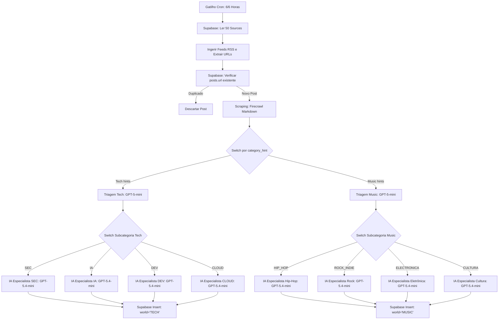

# 🤖 Fluxo de Automação n8n: Pipeline fresh-news-platform (v2.0)

Este documento descreve e detalha a arquitetura do workflow de automação do **n8n** integrado ao Fresh News Platform. Ele configura a ingestão autônoma de notícias de múltiplos canais RSS, deduplicação no banco de dados Supabase, raspagem de conteúdo completo e classificação agêntica em múltiplos níveis usando inteligência artificial.

---

## 1. Arquitetura do Pipeline Real (Multiverso)

O fluxo do n8n é projetado para processar posts separando-os por universos (`world = 'TECH'` ou `world = 'MUSIC'`). A separação lógica é feita no início por um Switch baseado em `category_hint` da fonte de origem.



---

## 2. Detalhes de Ingestão e Raspagem (Firecrawl)

1. **Gatilho de Ingestão:** Ativado periodicamente via Cron ou manualmente no painel admin.
2. **Leitura das Fontes:** O n8n busca todos os registros ativos (`is_active = true`) na tabela `public.sources`.
3. **Deduplicação Inteligente:** Para cada item do feed RSS, o nó do Supabase executa um SELECT rápido na tabela `posts` filtrando por `url`. Se o registro já existir, o processamento daquele item é abortado instantaneamente.
4. **Raspagem Estendida (Firecrawl API):** O n8n chama o scraper da API Firecrawl em `https://firecrawl.wfixtech.com.br/v1/scrape` passando a URL da notícia para extrair o conteúdo completo limpo em formato Markdown.

---

## 3. Classificadores e Especialistas de IA

A classificação ocorre em dois níveis para garantir alta precisão e baixo custo de tokens:

### Nível 1: Triagem & Direcionamento (GPT-5-mini)
O nó de triagem analisa o título e o Markdown da notícia raspada para categorizar o post.

* **Prompt do Classificador Tech:**
  ```text
  Você é o Editor-Chefe de Triagem da Fresh News (Tech).
  Sua missão é analisar o texto fornecido e classificar a notícia na subcategoria correta.
  Subcategorias disponíveis:
  - SEC: Vulnerabilidades, cibersegurança, exploits, privacidade.
  - IA: Inteligência Artificial, LLMs, Machine Learning.
  - DEV: Linguagens de programação, engenharia de software, frameworks.
  - CLOUD: Infraestrutura, cloud computing, Docker, DevOps.

  Retorne rigorosamente apenas um JSON com:
  {
    "sub_category": "SEC" | "IA" | "DEV" | "CLOUD",
    "routing_reason": "Breve justificativa."
  }
  ```

* **Prompt do Classificador Musical [NOVO]:**
  ```text
  Você é o Editor-Chefe de Triagem da Fresh News (Music).
  Sua missão é analisar a notícia sobre música e classificá-la na subcategoria correta.
  Subcategorias disponíveis:
  - HIP_HOP: Cultura urbana, rap, hip-hop, produções e beats.
  - ROCK_INDIE: Rock, indie, guitarras, festivais e bandas.
  - ELECTRONICA: Eletrônica, techno, DJs, sintetizadores e sintetizadores modulares.
  - CULTURA: Fallback musical, cultura geral, festivais de múltiplos estilos.

  Retorne rigorosamente apenas um JSON com:
  {
    "sub_category": "HIP_HOP" | "ROCK_INDIE" | "ELECTRONICA" | "CULTURA",
    "routing_reason": "Breve justificativa."
  }
  ```

### Nível 2: Redação Especialista & Sumarização (GPT-5.4-mini)
O post é encaminhado para a IA especialista na subcategoria correspondente, responsável por:
1. Redigir um resumo técnico executivo de alto impacto técnico em pt-BR.
2. Calcular o score de relevância da notícia de 0 a 100.
3. Formatar o resumo para o WhatsApp (teaser minimalista).
4. Gerar as cores de destaque e estilos no `theme_config` JSONB.

---

## 4. Estrutura de Inserção no Supabase (`public.posts`)

Ao final do processamento agêntico, o n8n executa a inserção do post com os seguintes campos mapeados:

| Campo do Banco | Origem da Payload do n8n | Descrição |
|:---|:---|:---|
| `title` | `{{ $json.headline }}` | Título limpo brutalista gerado pela IA. |
| `url` | `{{ $json.link }}` | Link original da notícia. |
| `content` | `{{ $json.markdown }}` | Conteúdo completo limpo extraído pelo Firecrawl. |
| `summary` | `{{ $json.summary }}` | Resumo executivo refinado pela IA especialista. |
| `score` | `{{ $json.score }}` | Nota de relevância técnica ou cultural. |
| `category` | `{{ $json.category }}` | `'TECH_HACKER'` para Tech, `'MUSIC'` para Música. |
| `sub_category` | `{{ $json.sub_category }}` | Subcategoria específica do nicho correspondente. |
| `world` | `{{ $json.world }}` | Universo/Mundo (`'TECH'` ou `'MUSIC'`). |
| `theme_config` | `{{ $json.theme_config }}` | Cores HSL e efeitos visuais chameleon. |
| `whatsapp_summary`| `{{ $json.whatsapp_teaser }}` | Versão minimalista de mensagem com emoji. |
| `status` | `'pending'` | Inserido como pendente para moderação no Admin. |

---

## 5. Webhook de Distribuição (WhatsApp & Email)

Quando o editor aprova as notícias e clica em **"Publicar"** no painel administrativo `/admin`:
1. O Next.js faz o deploy da edição e dispara um POST HTTP para o Webhook de Distribuição do n8n.
2. O n8n segmenta os emails usando o motor de afinidades.
3. O n8n envia a requisição HTTP POST formatada para o webhook da **Evolution API** para disparar no WhatsApp dos usuários que possuem o mundo ativo e preferências correspondentes.
