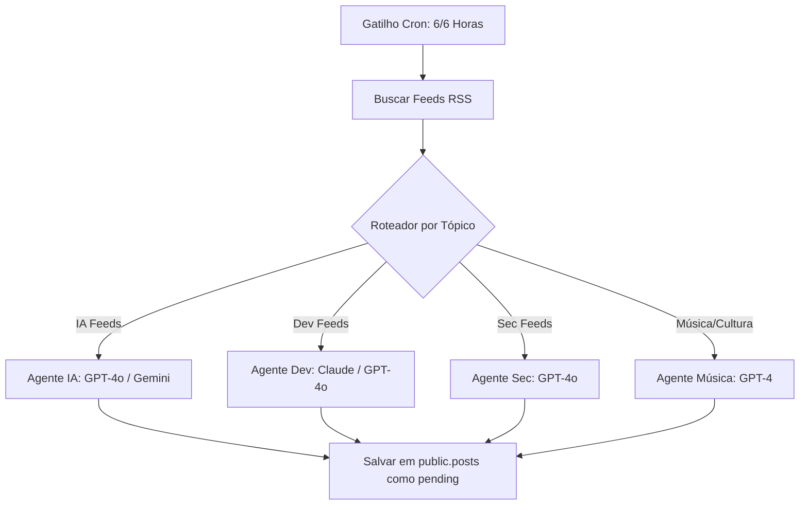

# 🤖 Templates de Workflows do n8n: Agentes de IA do Fresh News

Este documento contém o design do pipeline de automação e os templates estruturados em formato **JSON** para importar diretamente no seu painel do **n8n**. Ele configura os Agentes de IA especialistas em nichos para buscar, resumir, categorizar e salvar notícias automaticamente no banco de dados Supabase.

---

## 1. Arquitetura do Pipeline do n8n

O fluxo no n8n é dividido em 3 camadas principais:
1.  **Gatilho (Cron / Webhook)**: Roda a cada 6 ou 12 horas para buscar novos feeds de notícias.
2.  **Agentes de IA (Especialistas)**: Orquestração paralela com LLMs especialistas por categoria (IA, Dev, Sec, Música).
3.  **Bandeja de Entrada (Supabase)**: Inserção dos registros formatados e com score técnico na tabela `public.posts`.



---

## 2. Template JSON do Workflow de Ingestão (Importar no n8n)

Para instalar o workflow completo:
1. Abra o painel do seu n8n.
2. Clique em **Workflows** -> **Add Workflow**.
3. No canto superior direito, clique nos três pontinhos (**...**) e selecione **Import from file...** (ou simplesmente dê um `Ctrl+C` no código JSON abaixo e `Ctrl+V` diretamente na tela em branco do n8n).

```json
{
  "name": "Fresh News - Ingestão Inteligente e Agentes de IA",
  "nodes": [
    {
      "parameters": {
        "rule": {
          "interval": [
            {
              "field": "hours",
              "hoursInterval": 6
            }
          ]
        }
      },
      "type": "n8n-nodes-base.scheduleTrigger",
      "typeVersion": 1.1,
      "position": [
        0,
        240
      ],
      "id": "trigger_cron"
    },
    {
      "parameters": {
        "url": "https://hnrss.org/frontpage"
      },
      "type": "n8n-nodes-base.httpRequest",
      "typeVersion": 4.1,
      "position": [
        200,
        140
      ],
      "id": "rss_hackernews"
    },
    {
      "parameters": {
        "url": "https://techcrunch.com/feed/"
      },
      "type": "n8n-nodes-base.httpRequest",
      "typeVersion": 4.1,
      "position": [
        200,
        340
      ],
      "id": "rss_techcrunch"
    },
    {
      "parameters": {
        "options": {}
      },
      "type": "n8n-nodes-base.xml",
      "typeVersion": 1,
      "position": [
        420,
        240
      ],
      "id": "xml_parser"
    },
    {
      "parameters": {
        "promptType": "define",
        "text": "=Você é o Agente Editorial da Fresh News especialista no nicho de tecnologia/IA. Analise a seguinte notícia e retorne um JSON estruturado contendo:\n1. 'headline': Título técnico e focado (estilo brutalista, sem sensacionalismo).\n2. 'summary': Resumo analítico de 2 a 3 parágrafos curtos explicando o impacto prático.\n3. 'score': Nota de relevância técnica de 0 a 100.\n4. 'category': Sempre 'IA'.\n\nNotícia:\nTítulo: {{ $json.title }}\nLink: {{ $json.link }}\nDescrição: {{ $json.description }}",
        "options": {
          "responseFormat": "json_object"
        }
      },
      "type": "n8n-nodes-base.openAi",
      "typeVersion": 1.1,
      "position": [
        640,
        140
      ],
      "id": "agente_ia"
    },
    {
      "parameters": {
        "operation": "upsert",
        "schema": {
          "__rls": true
        },
        "table": "posts",
        "columns": {
          "mappingMode": "defineBelow",
          "value": {
            "title": "={{ $json.headline }}",
            "url": "={{ $json.link }}",
            "summary": "={{ $json.summary }}",
            "score": "={{ $json.score }}",
            "category": "={{ $json.category }}",
            "status": "pending"
          }
        }
      },
      "type": "n8n-nodes-base.supabase",
      "typeVersion": 1,
      "position": [
        900,
        240
      ],
      "id": "supabase_insert"
    }
  ],
  "connections": {
    "trigger_cron": {
      "main": [
        [
          {
            "node": "rss_hackernews",
            "type": "main",
            "index": 0
          },
          {
            "node": "rss_techcrunch",
            "type": "main",
            "index": 0
          }
        ]
      ]
    },
    "rss_hackernews": {
      "main": [
        [
          {
            "node": "xml_parser",
            "type": "main",
            "index": 0
          }
        ]
      ]
    },
    "rss_techcrunch": {
      "main": [
        [
          {
            "node": "xml_parser",
            "type": "main",
            "index": 0
          }
        ]
      ]
    },
    "xml_parser": {
      "main": [
        [
          {
            "node": "agente_ia",
            "type": "main",
            "index": 0
          }
        ]
      ]
    },
    "agente_ia": {
      "main": [
        [
          {
            "node": "supabase_insert",
            "type": "main",
            "index": 0
          }
        ]
      ]
    }
  },
  "settings": {
    "executionOrder": "v1"
  }
}
```

---

## 3. Guia de Configuração dos Agentes

### 1. Agente de IA (`agente_ia`)
*   **Prompt de Engenharia**: Focado em extrair o impacto em infraestrutura, arquitetura ou algoritmos de IA.
*   **Modelos Recomendados**: `gpt-4o` ou `gemini-1.5-pro` (devido à alta precisão em saídas estruturadas JSON).

### 2. Agente de Cibersegurança (`agente_sec`)
*   **Prompt de Engenharia**: Focado em analisar vetores de ataque, vulnerabilidades conhecidas (CVEs), exploits de dia zero e impactos geopolíticos de breaches.
*   **Modelo Recomendado**: `gpt-4o-mini` (rápido e econômico para análise de grandes logs de texto de feeds de segurança).

### 3. Agente de Música e Cultura (`agente_musica`)
*   **Prompt de Engenharia**: Focado em tendências sonoras, novos sintetizadores baseados em rede neural, movimentos artísticos underground, lançamentos musicais independentes e festivais eletrônicos avant-garde.
*   **Modelo Recomendado**: `gpt-4` ou `claude-3-haiku` (excelente sensibilidade estética e riqueza poética).

---

## 4. Integração com WhatsApp (Evolution API no n8n)

Para disparar as mensagens no WhatsApp via n8n quando a newsletter for publicada no Next.js:
1.  O Next.js envia o Webhook HTTP POST contendo a payload minimalista compilada em `distributeNewsletter` para a URL do trigger do n8n.
2.  No n8n, configure um nó **Evolution API** (ou HttpRequest comum) apontando para a sua instância Evolution com os seguintes parâmetros:
    *   **Endpoint**: `https://sua-instancia.com/message/sendText/sua-sessao`
    *   **Headers**:
        *   `apikey`: `sua-apikey-evolution`
        *   `Content-Type`: `application/json`
    *   **Body (JSON)**:
        ```json
        {
          "number": "{{ $json.to }}",
          "options": {
            "delay": 2000,
            "linkPreview": true
          },
          "textMessage": {
            "text": "{{ $json.message }}"
          }
        }
        ```
3.  O delay de 2000ms configurado nas opções da Evolution API garante que haja um espaçamento orgânico de 2 segundos entre mensagens para diferentes assinantes, mitigando riscos de banimento de conta.
